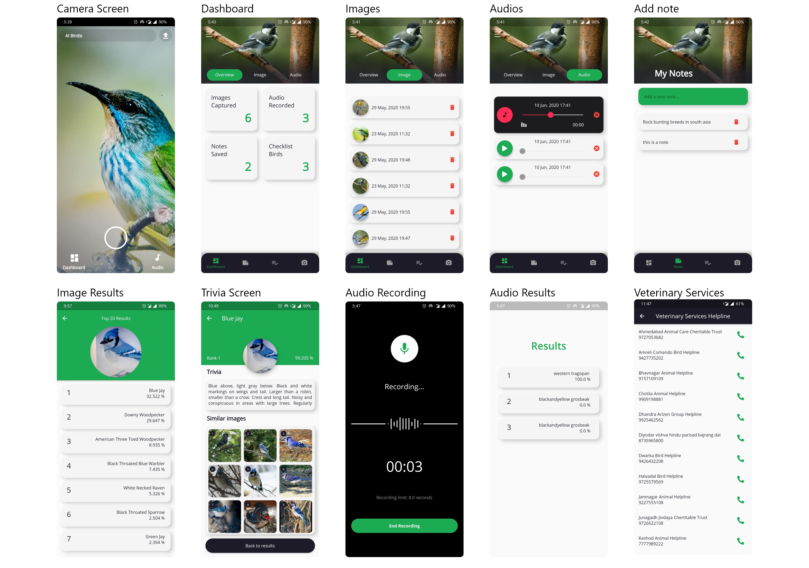
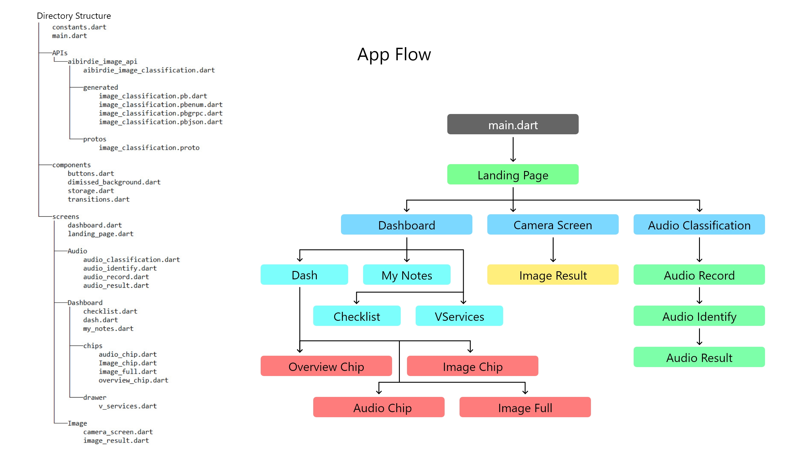

# AI Birdie

An android application for automated multimodal identification of birds species from visual and acoustic data by employing deep learning processes and audio GANs (Generative Adversarial Network).

## Download here

## Screenshots

## Application Flow

## App Demonstration

